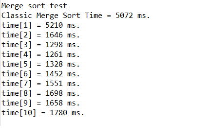

# Merge Sort
Project for operating systems for embedded systems.
Multihread merge sort implementation based on osapi lib.

## Structure
- `merge_sort.cpp` Implementation of the algorithm.
- `file.cpp` Helper class to allow easily reading target file.
- `main.cpp` Test program. It checks execution time of the algorithm for singlethread as well as multithread version.
This program runs algorithm for each number of thread multiple times and averages the result. Execution times are printed into standard output.

## Algorithm

The algorithm is classic merge sort based on this tutorial : 
`https://www.programiz.com/dsa/merge-sort`

extended for many threads. Each thread executes merge sort on portion of the input array in parallel.
Then all subarrays are merged one ofter another in the main thread.

Complexity of the algorithm is N*log(N) * (1/K) + N * (K/2).

This second factor is produced due to serial part of the algorithm.

## How to compile and run?

- Eclipse build is provided in this repo. In case of trouble with compiling please let me know.
- `merge_sort_input.txt` file must be provided in order to run the program.
- Each number must be placed in separate line with no newlines at the end of file.
- Program automatically reads number of data to be sorted.
- Python script `generate_file.py` can be used to generate array to be sorted.

## Checking output

In order to check the output `merge_sort_output.py` file can be reviewed.

## Results

Following results were produced with 200000 integers, 1-10 threads and intel i5 7th generation processor:

